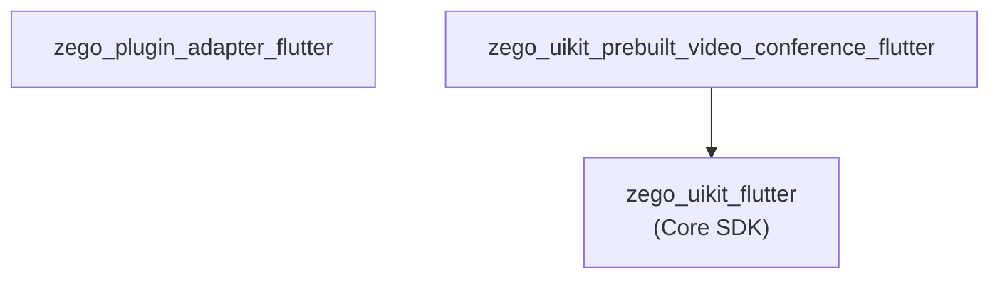

# ZegoUIKitPrebuiltVideoConference Architecture

> Video conference SDK for multi-party video call scenarios

## Overview

`zego_uikit_prebuilt_video_conference_flutter` is a **prebuilt UI SDK for video conferencing**:

- **Multi-party video calls**: Supports multiple people in simultaneous video conferences
- **Member management**: Join/leave, member list
- **Layout switching**: Grid/PiP and other layouts
- **Real-time text chat**: In-room text messaging

**Depends on**: `zego_uikit_flutter` (core SDK)

## Package Relationship



## Core Pattern: Equal Participants

In video conferences, all participants are equal with no host concept:

```
ZegoUIKitPrebuiltVideoConference
       │
       ├── All users can join/leave equally
       ├── All users can toggle their own audio/video
       └── No special host permissions
```

## Quick Start

```dart
import 'package:zego_uikit_prebuilt_video_conference/zego_uikit_prebuilt_video_conference.dart';

class ConferencePage extends StatelessWidget {
  @override
  Widget build(BuildContext context) {
    return ZegoUIKitPrebuiltVideoConference(
      appID: yourAppID,
      appSign: yourAppSign,
      conferenceID: 'conference_001',  // Conference ID
      userID: currentUserID,
      userName: currentUserName,
      config: ZegoUIKitPrebuiltVideoConferenceConfig()
        ..turnOnCameraWhenJoining = true
        ..turnOnMicrophoneWhenJoining = false
        ..bottomMenuBarConfig(
          buttons: [
            ZegoVideoConferenceMenuBarButtonName.toggleMicrophone,
            ZegoVideoConferenceMenuBarButtonName.toggleCamera,
            ZegoVideoConferenceMenuBarButtonName.switchCamera,
            ZegoVideoConferenceMenuBarButtonName.hangUp,
          ],
        ),
      events: ZegoUIKitPrebuiltVideoConferenceEvents(
        onConferenceEnd: (reason) {
          Navigator.pop(context);
        },
      ),
    );
  }
}
```

## Configuration Pattern

```dart
ZegoUIKitPrebuiltVideoConferenceConfig config = ZegoUIKitPrebuiltVideoConferenceConfig()
  // Device state when joining
  ..turnOnCameraWhenJoining = true
  ..turnOnMicrophoneWhenJoining = false
  ..useFrontCameraWhenJoining = true

  // Top menu bar
  ..topMenuBarConfig(
    title: 'Video Conference',
    showUserInviteButton: true,
    showCloseButton: true,
  )

  // Bottom menu bar
  ..bottomMenuBarConfig(
    buttons: [
      ZegoVideoConferenceMenuBarButtonName.toggleMicrophone,
      ZegoVideoConferenceMenuBarButtonName.toggleCamera,
      ZegoVideoConferenceMenuBarButtonName.switchCamera,
      ZegoVideoConferenceMenuBarButtonName.memberList,
      ZegoVideoConferenceMenuBarButtonName.chat,
      ZegoVideoConferenceMenuBarButtonName.hangUp,
    ],
  )

  // Member list
  ..memberListConfig(
    showMicrophoneState: true,
    showCameraState: true,
  )

  // Chat view
  ..chatViewConfig(
    showInCallMessage: true,
  )

  // Avatar
  ..avatarBuilder = (context, size, user, extraInfo) {
    return Container(
      decoration: BoxDecoration(
        shape: BoxShape.circle,
        color: Colors.blue,
        image: DecorationImage(
          image: NetworkImage('https://api.example.com/avatar/${user.id}'),
        ),
      ),
    );
  };
```

### Video Config

```dart
// Configure video quality
..videoConfig = ZegoUIKitVideoConfig.preset720p()

// Or custom
..videoConfig = ZegoUIKitVideoConfig(
  resolution: ZegoVideoResolution(1280, 720),
  frameRate: 30,
  bitrate: 3000,
)
```

## Controller API

```dart
final controller = ZegoUIKitPrebuiltVideoConferenceController();

// Leave conference
await controller.leave();

// Audio/video control
controller.audioVideo.muteMicrophone(true);
controller.audioVideo.muteCamera(true);
controller.audioVideo.toggleCamera();
controller.audioVideo.switchCamera();

// User management
final users = controller.user.getAllUsers();
final speakers = controller.user.getSpeakers();

// Message
controller.message.send('Hello everyone!');
```

### Controller Mixins

| Mixin | Description |
|-------|-------------|
| `ZegoVideoConferenceControllerAudioVideo` | Audio/video control |
| `ZegoVideoConferenceControllerRoom` | Room operations |
| `ZegoVideoConferenceControllerUser` | User management |
| `ZegoVideoConferenceControllerMessage` | Message |
| `ZegoVideoConferenceControllerMedia` | Media control |
| `ZegoVideoConferenceControllerScreenSharing` | Screen sharing |

## Events

```dart
ZegoUIKitPrebuiltVideoConferenceEvents(
  // User events
  onUserJoin: (user) {
    print('${user.name} joined');
  },
  onUserLeave: (user) {
    print('${user.name} left');
  },

  // Device state changed
  onUserCameraTurnOn: (user) {
    print('${user.name} turned on camera');
  },
  onUserCameraTurnOff: (user) {
    print('${user.name} turned off camera');
  },
  onUserMicrophoneTurnOn: (user) {
    print('${user.name} turned on microphone');
  },
  onUserMicrophoneTurnOff: (user) {
    print('${user.name} turned off microphone');
  },

  // Message
  onReceiveChatMessage: (fromUser, message) {
    print('${fromUser.name}: $message');
  },

  // Conference end
  onConferenceEnd: (reason) {
    print('Conference ended: $reason');
    Navigator.pop(context);
  },

  // Error
  onError: (errorCode, errorMessage) {
    print('Error: $errorCode - $errorMessage');
  },

  // Screen sharing
  onScreenSharingStarted: (user) {},
  onScreenSharingStopped: (user) {},
)
```

## Layout Modes

### Grid Layout (Default)

All participants displayed in a grid, suitable for small conferences:

```dart
..layoutConfig = ZegoVideoConferenceLayoutConfig(
  mode: ZegoVideoConferenceLayoutMode.grid,
  maxDisplayCount: 9,  // Max 9 videos displayed
)
```

### Gallery Layout

Auto-adjusting grid size:

```
4 people: 2x2    9 people: 3x3    16 people: 4x4
```

### Speaker Mode

Highlights current speaker, others in small windows:

```dart
..layoutConfig = ZegoVideoConferenceLayoutConfig(
  mode: ZegoVideoConferenceLayoutMode.speaker,
)
```

## Directory Structure

```
lib/src/
├── video_conference.dart       # Main entry Widget
├── controller.dart            # Controller singleton
├── config.dart               # ZegoUIKitPrebuiltVideoConferenceConfig
├── events.dart               # Events
├── defines.dart
├── inner_text.dart
├── components/              # UI components
│   ├── components.dart
│   ├── top_bar.dart
│   ├── bottom_bar.dart
│   ├── member/
│   │   ├── member_list.dart
│   │   └── member_list_item.dart
│   ├── message/
│   │   ├── chat_view.dart
│   │   └── message_item.dart
│   ├── duration_time_board.dart
│   ├── pop_up_manager.dart
│   └── audio_video_view_foreground.dart
├── controller/              # Controller mixins
│   ├── audio_video.dart
│   ├── room.dart
│   ├── user.dart
│   ├── message.dart
│   ├── media.dart
│   ├── screen_sharing.dart
│   └── private/
├── core/                    # Core managers
│   └── live_duration_manager.dart
├── internal/
└── build/
```

## Key Differences from Call SDK

| Aspect | Video Conference | Call SDK |
|--------|-----------------|----------|
| Use Case | Meeting, collaboration | 1v1/group calls |
| Role Model | Equal participants | Host/participant roles |
| Layout | Grid with member list | Full-featured call UI |
| Invite | No built-in invite | Call invitation system |
| Duration | No auto-end timer | Has duration timer |

## Comparison with Other Prebuilt SDKs

| Feature | Call | Live Streaming | Audio Room | Video Conference |
|---------|------|---------------|------------|-----------------|
| Video | ✓ | ✓ | ✗ | ✓ |
| Audio Only Mode | ✓ | ✓ | ✓ | ✓ |
| Role Model | Host/Participant | Host/Co-host/Audience | Host/Speaker/Listener | Equal |
| Invite System | ✓ | ✗ | ✗ | ✗ |
| PK | ✗ | ✓ | ✗ | ✗ |
| Seat/Stage | ✗ | ✗ | ✓ | ✗ |
| Swiping | ✗ | ✓ | ✗ | ✗ |

## Dependency Packages

Core dependencies:
- `zego_uikit` - Core SDK
- `zego_plugin_adapter` - Plugin adapter
- `permission_handler` - Permission management

## Related Documentation

- [ZegoUIKit Architecture](../zego_uikit_flutter/ARCHITECTURE.md)
- [ZegoUIKitPrebuiltCall Architecture](../zego_uikit_prebuilt_call_flutter/ARCHITECTURE.md)
- [ZegoUIKitPrebuiltLiveStreaming Architecture](../zego_uikit_prebuilt_live_streaming_flutter/ARCHITECTURE.md)
